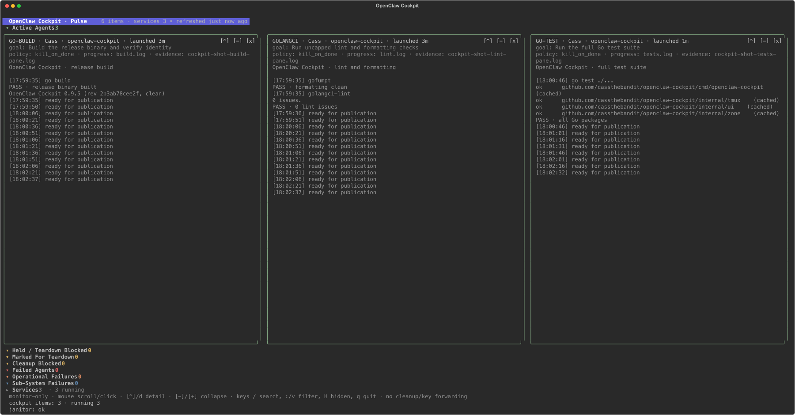

# OpenClaw Cockpit

> **TL;DR:** OpenClaw Cockpit turns your tmux sessions into one live terminal wall. It is built for people running several CLI agents, builds, tests, and long-lived services who want to see what is active, waiting, failed, or finished without hopping between panes.



_The screenshot above is a real Cockpit render of three deterministic tmux jobs running this repository's build, lint, and test commands._

## Why it exists

tmux is excellent at keeping terminal work alive. It is less helpful when ten sessions are running and you need a quick answer to simple questions:

- Which agent is still working?
- Which job is waiting for input?
- What failed?
- Did the tests finish?
- Are the background services healthy?

Cockpit answers those questions from one screen. It reads tmux directly, captures the useful tail of each pane, and arranges the sessions into a glanceable wall. Your jobs keep running in their original tmux sessions.

Cockpit started as a fork of Peter Steinberger's [tmuxwatch](https://github.com/steipete/tmuxwatch). It keeps that history and MIT attribution while adding the operator-focused grouping, lifecycle display, safety boundaries, and OpenClaw integrations used here.

## What it does

- **Finds your tmux work automatically.** Sessions, windows, panes, titles, commands, and recent output appear without a separate registry.
- **Keeps live output visible.** Pane previews update in place, can preserve ANSI colors, and stay bottom-anchored unless you scroll back.
- **Prioritizes agent work.** Organized mode separates active agents, failures, cleanup blockers, services, completed runs, dashboards, viewers, and idle shells.
- **Makes a crowded wall navigable.** Search, session tabs, card collapse, detail view, keyboard navigation, mouse controls, and whole-wall scrolling are built in.
- **Stays read-only by default.** Monitor mode never kills sessions, cleans up jobs, or forwards keys into a pane. `--control` must be supplied explicitly to enable partial key forwarding.
- **Adds optional OpenClaw context.** Managed `@oc_*` tmux metadata, a janitor status sidecar, and runtime snapshot cards can add ownership and lifecycle detail when those sources are available.
- **Supports scripts and debugging.** `--dump` returns the current tmux topology as JSON, and `--dump-config` prints the effective wall configuration.

Cockpit is a viewer, not an orchestrator or process supervisor. tmux owns the sessions. Your agent runners own the jobs. External lifecycle tools own cleanup.

## Quick start

You need tmux plus either Go 1.25.11 or Nix. macOS and Linux are the primary targets; Windows users can run it under WSL with tmux.

### Install with Go

```sh
go install github.com/cassthebandit/openclaw-cockpit/cmd/openclaw-cockpit@latest
```

### Run with Nix

```sh
nix run github:cassthebandit/openclaw-cockpit
```

### Open the wall

Running Cockpit in its own tmux session keeps it separate from the jobs it watches. The exclusion flag prevents the dashboard from showing itself as another card.

```sh
tmux new-session -s cockpit \
  'openclaw-cockpit --organize --preserve-colors --exclude-session cockpit'
```

Attach to that session later with `tmux attach -t cockpit`. Press `q` or `ctrl+c` to leave Cockpit; the tmux jobs it was watching continue to run.

For a plain ungrouped view, run `openclaw-cockpit` without `--organize`.

## Everyday controls

```text
/ or ctrl+f        search sessions, windows, panes, and captured text
arrow keys         move between cards; scroll a focused card
page up/down       page the wall, or scroll a focused card
shift+left/right   switch between the wall and session tabs
d / ctrl+m         open or close the session detail view
enter              focus a card; Esc Esc releases pane focus
: / v              select a view filter
c / C              toggle current group / expand all groups
z / Z              collapse the focused card / expand all cards
H                  show locally hidden cards
ctrl+P             open the command palette
esc                clear search or return to the wall
q / ctrl+c         quit Cockpit
mouse              focus, scroll, collapse, hide, or open a card
```

The `[x]` card control only hides a card from the current view. It does not stop the tmux session.

## Useful flags

```text
--organize                       group cards by operator state
--preserve-colors                keep ANSI colors in pane previews
--exclude-session a,b            hide named tmux sessions
--cols N                         prefer N overview columns (0 = automatic)
--interval 1s                    set the tmux polling interval
--capture-budget N               cap background pane captures per tick
--config PATH                    load wall settings from JSON
--dump                           print a tmux snapshot as JSON and exit
--dump-config                    print effective wall settings and exit
--validate-config                validate settings without starting the TUI
--explain-config                 explain explicit overrides on stderr
--control                        enable partial key forwarding to focused panes
--janitor-status PATH            read an optional cleanup-status sidecar
--openclaw-runtime               include optional OpenClaw runtime cards
--openclaw-runtime-script PATH   choose the runtime snapshot producer
```

Run `openclaw-cockpit -h` for the complete current list.

## User settings

Copy [the complete defaults example](examples/config.example.json) to
`~/.config/openclaw-cockpit/config.json`, edit it, run
`openclaw-cockpit --validate-config`, then restart Cockpit. Use
`--dump-config --explain-config` to inspect resolved values and overrides.
Explicit CLI flags win over supported environment variables, which win over
the file and built-in defaults. See the [settings reference](docs/config-contract.md)
for ranges, grouping keywords, integration paths and compatibility aliases.
The optional sibling `lifecycle.json` is helper-owned; no display setting can
close a terminal or change a hold.

## Optional OpenClaw integration

Cockpit works with ordinary tmux sessions on its own. OpenClaw integration is additive:

- `@oc_*` tmux options can identify an agent, owner, state, hold, cleanup policy, and evidence path.
- `--janitor-status` can display cleanup counts, blockers, and teardown countdowns from a sidecar JSON file.
- `--openclaw-runtime` can merge read-only runtime cards from a compatible `runtime-card.v1` snapshot script. By default Cockpit looks for the public helper bundle at `~/.local/share/openclaw-cockpit/helpers/openclaw_runtime/cockpit_snapshot.py` (or `helpers/` beside the binary/in the checkout); use `--openclaw-runtime-script` to point elsewhere.

Missing optional sources appear as visible source errors. They never give Cockpit cleanup authority.

## Configuration

Cockpit reads `~/.config/openclaw-cockpit/config.json` unless `--config` names another file. The current config controls a small set of display choices:

```json
{
  "footer_max_height": 4,
  "janitor_stale_after": "3m",
  "stale_threshold": "1h",
  "collapsed_groups": ["Services", "Completed Agent Runs"],
  "expanded_groups": ["Active Agents"]
}
```

Unknown fields are rejected. Use `openclaw-cockpit --dump-config` to inspect the effective settings. The full contract is in [`docs/config-contract.md`](docs/config-contract.md).

## Development

```sh
gofumpt -w .
golangci-lint run --timeout=5m --max-issues-per-linter=0 --max-same-issues=0
go test ./...
go test -race ./...
go build ./cmd/openclaw-cockpit
```

`./gorunfresh` clears the Go build cache and runs the current source. `./gorunfresh --watch` uses the optional Poltergeist development loop described in [`docs/hotreload.md`](docs/hotreload.md).

The code is split into a small CLI entry point, a tmux client under `internal/tmux`, and the Bubble Tea interface under `internal/ui`. Start with [`VISION.md`](VISION.md) for product boundaries and [`DESIGN_BRIEF.md`](DESIGN_BRIEF.md) for the design contract. Detailed lifecycle, grouping, layout, and configuration rules live under [`docs/`](docs/).

## License

Released under the [MIT License](LICENSE).

### macOS Dock launcher

After installing Cockpit and tmux, run `python3 scripts/install-macos-launcher.py --dock`.
This installs a script-backed **OpenClaw Cockpit.app** in `~/Applications`, with an
original artificial-horizon icon (source: `assets/cockpit.svg`, same license as this
project). Clicking it opens or focuses its Terminal tab and attaches to the existing
`cass-agents` dashboard. If absent, it starts the dashboard; it does not restart
workers. An existing OpenClaw workspace launcher is used when available.
The optional Dock pin preserves other tiles and saves the previous Dock preferences
under `~/Library/Application Support/OpenClaw Cockpit/dock-before.plist`.

Card age uses the recorded runtime launch time, falling back to clearly labeled
native tmux **session** age. Viewer/service kinds override incidental agent labels;
quiet live previews are not failures. Cleanup remains the external janitor's job.
